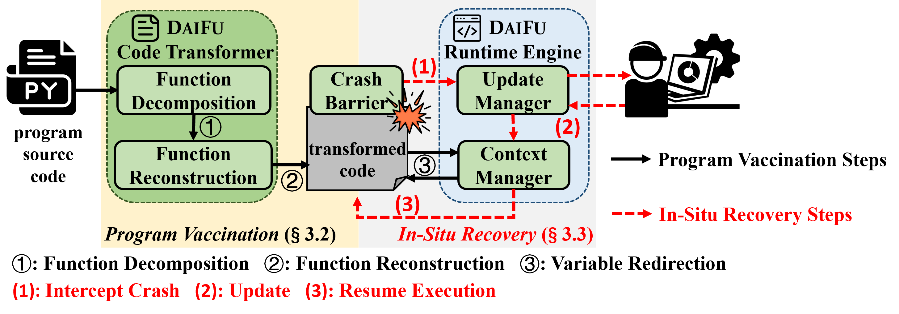
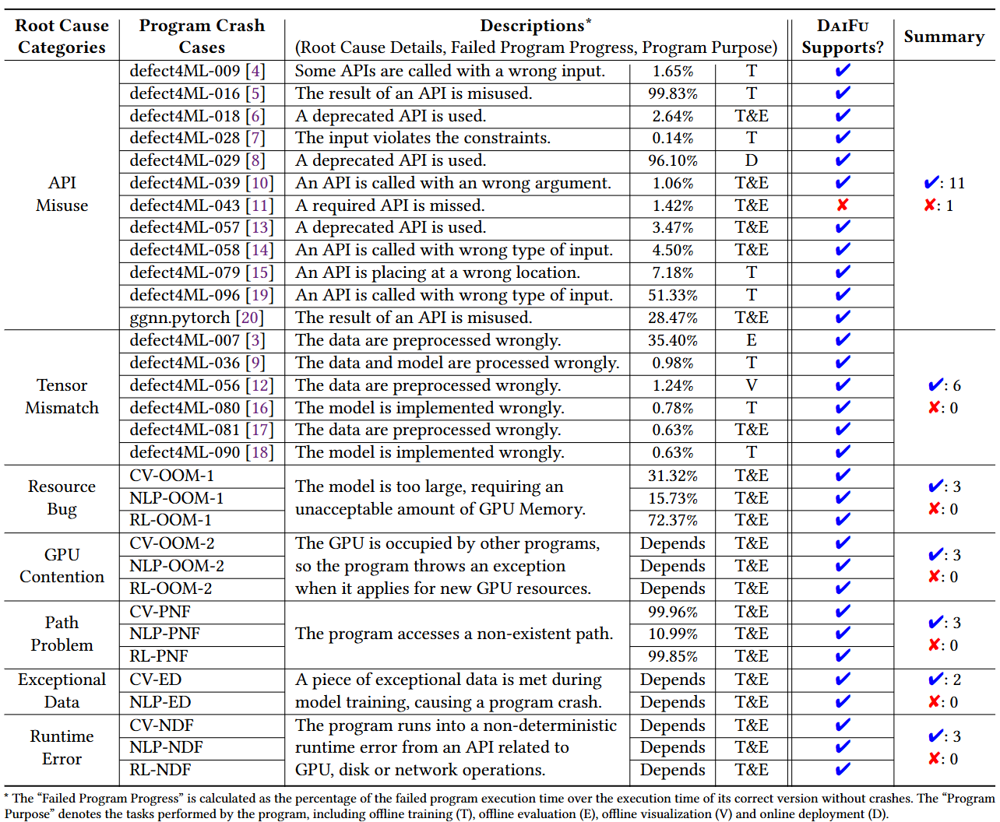
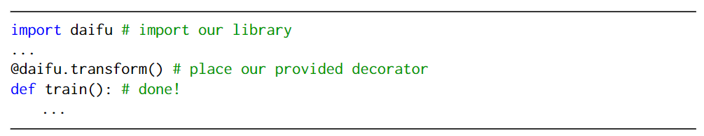

# DaiFu: In-Situ Crash Recovery for Deep Learning Systems


DaiFu is an in-situ crash recovery framework for Deep Learning (DL) systems that uses a lightweight "vaccination" code transformation to intercept crashes and enable instant, dynamic updates to the program's running context without requiring a restart, significantly reducing restore time with negligible runtime overhead.

## Project Structure



- `./daifu` contains the source code of daifu.
- `./DLFailureBenchmark` contains the deep learning failure benchmark as well as our experiments on it.

## User Manual

- [User Manual](./UserManual.md)
- [Crash Examples](./CrashExamples.md)

## Reproduce Experiments in Our Paper

### Preparation to use daifu

```
pip install loguru
pip install bidict
pip install better_exceptions
```

### Experiments on each case

In each case in `./DLFailureBenchmark`, the code is organized as follows.

- `buggy` contains the buggy version of a failed deep learning program, which will fail after execution.
- `fixed` contains its fault-free version, which will not fail after execution.

The command to execute them can be found in `fixed_repeated_experiments/repeat_experiments.py` or `test_suite.py`. Specifically, for each case, we need to first prepare a virtual environment according to `requirements.txt`. Then, we need to enter into the `buggy` or `fixed` directory to run the commands to see the result.

- `fixed_in_site` contains our code to use daifu to handle the failure of the buggy version in situ.

For each virtual encironment, we need to repeat the preparation to use daifu. Then we can use the command in `fixed_repeated_experiments/repeat_experiments.py` or `test_suite.py` to run the program and fix the failure in situ with daifu. The repair solution history can be found in `experiment_record.log` and files started with `(action)` or `(surgery)` in the `daifu_workplace`. 

- `fixed_in_site_repeated_experiments` and `fixed_repeated_experiments` contains our code to automatically repeat the experiemnts. We can directly execute the `repeat_experiments.py` to repeat the experiments. The experiment record logs are also provided in these directories.

## Details of the benchmark




## Try DaiFu on your own DL systems and programs

### Preparation to use daifu

```
pip install loguru
pip install bidict
pip install better_exceptions
```

### Try it
Import daifu and place its provided decorator in front of the entry function of your program



### Incoperate large language model to help root cause debugging **(not the main focus of this paper yet, but we still welcome you to try this function)**

First, deploy a server to forward LLM requests (e.g., to OpenAI GPT).

Then, configure the forward server address and port in the BASE_URL configuration in `daifu/daifu_repairbot/main.py`, and execute the following command in the path `daifu/daifu_repairbot/`:

```
uvicorn main:app --reload
```

Finally, place the following code after importing daifu in your program. Then you can get the automatic root cause debugging recommendation when your program encounters and intercepts a failure.

```
daifu.TRANSFORM_REGISTRY['IS_AUTOMATIC'] = True
```

